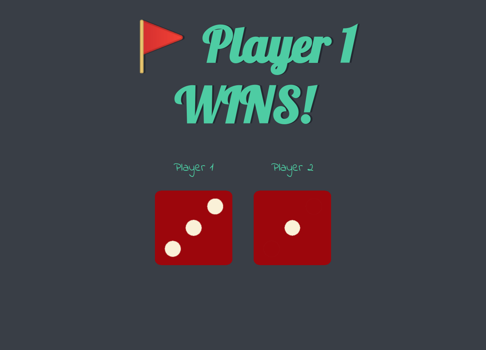

# dicee
A dice game using HTML, CSS and JavaScript.

## Randomize the dices every page's reload. The winner message depends of which dice has the bigger number, first dice for player 1 and second dice for player 2. If it random the same number, the massage says to reload the page.

